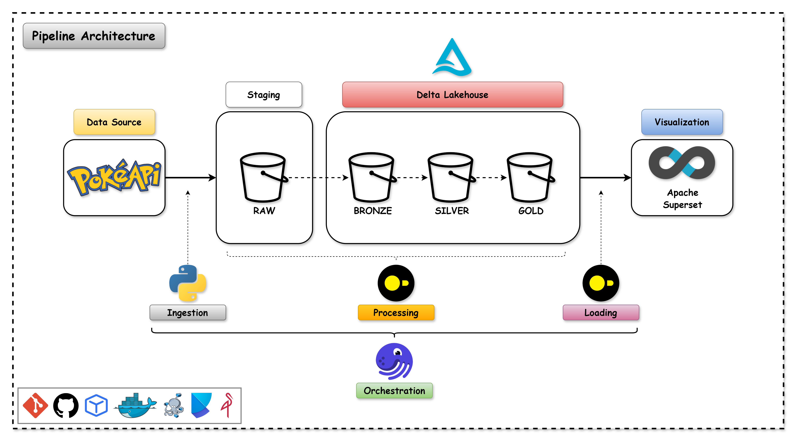
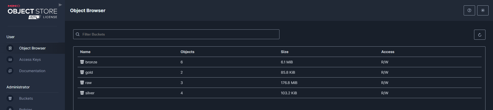
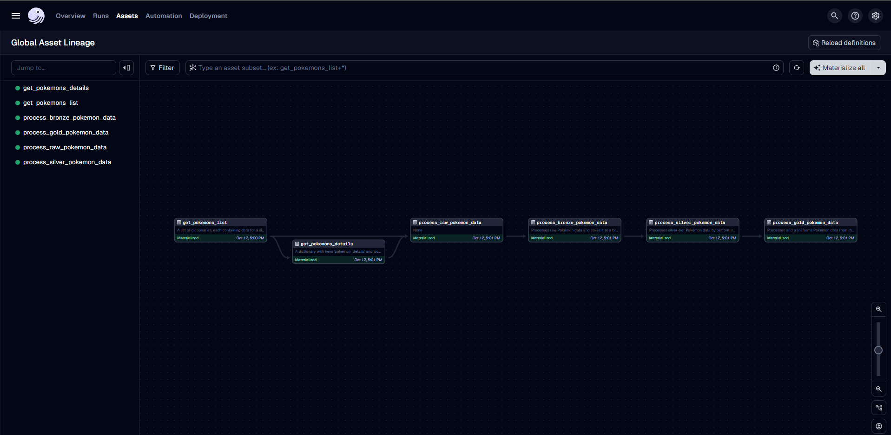
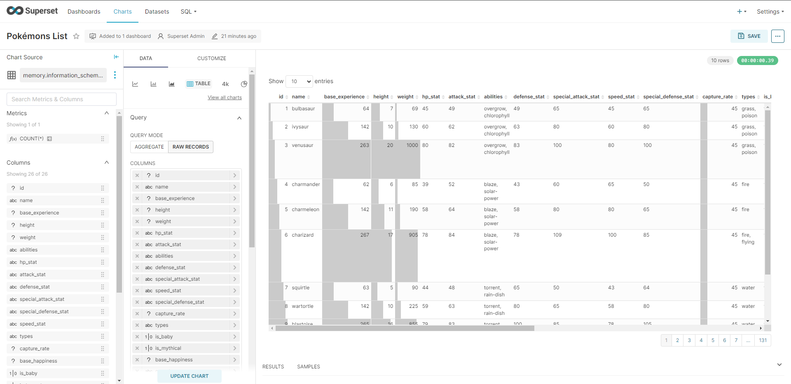

# Pokémon - Delta Lakehouse

The PokéAPI Data Pipeline project is a project that aims to create a data pipeline to extract, load, and transform data from the [PokéAPI](https://pokeapi.co/) into a Delta Lakehouse. The project uses Python, DuckDB, MinIO, Docker, Docker Compose, Dev Container, and Poetry.

## Table of Contents

- [About PokéAPI](#about-pokéapi)
- [Technologies](#technologies)
- [Problem Statement](#problem-statement)
  - [Data](#data)
  - [Data Pipeline Overview](#data-pipeline-overview)
  - [Medallion Architecture](#medallion-architecture)
  - [Pipeline Architecture](#pipeline-architecture)
- [Results](#results)
    - [Delta Lakehouse](#delta-lakehouse)
    - [Orchestration](#orchestration)
    - [Data Visualization](#data-visualization)
- [Conclusion](#conclusion)
- [License](#license)

## About PokéAPI

The PokéAPI is a RESTful API that provides data about the Pokémon games. The API provides data about the Pokémon species, abilities, moves, types, and more.

Pokemon is a media franchise created by Satoshi Tajiri and Ken Sugimori and is managed by The Pokémon Company, a collaboration between Nintendo, Game Freak, and Creatures. The franchise was created by Satoshi Tajiri and Ken Sugimori and is centered on fictional creatures called "Pokémon", which humans, known as Pokémon Trainers, catch and train to battle each other for sport.

The goal of the PokéAPI Data Pipeline project is to create a Delta Lakehouse with the data provided by the [PokéAPI](https://pokeapi.co/).

## Technologies

The PokéAPI Data Pipeline project uses the following technologies:
- Ingestion: [Python](https://www.python.org/)
- Processing: [DuckDB](https://www.duckdb.org/)
- Storage: [MinIO](https://min.io/)
- Orchestration: [Dagster](https://dagster.io/)
- Visualization: [Apache Superset](https://superset.apache.org/)
- Data format: [Delta](https://delta.io/)
- Infraestructure: [Docker](https://www.docker.com/), [Docker Compose](https://docs.docker.com/compose/), [Dev Container](https://code.visualstudio.com/docs/remote/containers)
- Tools: [Poetry](https://python-poetry.org/), [Pre-commit](https://pre-commit.com/), [Git](https://git-scm.com/), [GitHub](https://github.com/)

## Problem Statement

### Data

The data selected for the project is the `Pokémon` provided by the [PokéAPI](https://pokeapi.co/). The data includes the pokémons details for all the pokémons available in the API.

The data descriptions is available in the [PokéAPI Documentation](https://pokeapi.co/docs/v2).

### Data Pipeline Overview

This is a batch data pipeline that extracts data from the PokéAPI, transforms the data into a delta format and loads the data into a Delta Lakehouse.

The ELT steps are as follows:

1. **Extract:** Extract the data from the PokéAPI and store it in a raw format in the staging area.
2. **Load:** Load the data into a staging area.
3. **Transform:** Transform the data into a delta format it into the Delta Lakehouse.

### Medallion Architecture

The Medallion Architecture is a data architecture that uses the following components:

1. **Raw:** The Raw layer is the raw data layer that stores the raw data extracted from the source.
2. **Bronze:** The Bronze layer is the transformed data layer that stores the transformed data in a delta format.
3. **Silver:** The Silver layer is the curated data layer that stores the curated data in a delta format.
4. **Gold:** The Gold layer is the business data layer that stores the business data in a delta format.

### Pipeline Architecture

The architecture of the data pipeline is as follows:

## Results

### Delta Lakehouse

### Orchestration

### Data Visualization

## Conclusion

The PokéAPI Data Pipeline project is a project that aims to create a data pipeline to extract, load, and transform data from the [PokéAPI](https://pokeapi.co/) into a Delta Lakehouse. The project uses Python, DuckDB, MinIO, Docker, Docker Compose, Dev Container, and Poetry.

## License

This project is licensed under the MIT License - see the [LICENSE](LICENSE) file for details.

[Back to Top](#table-of-contents)
