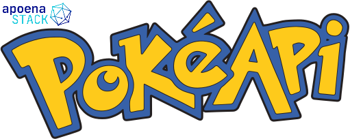
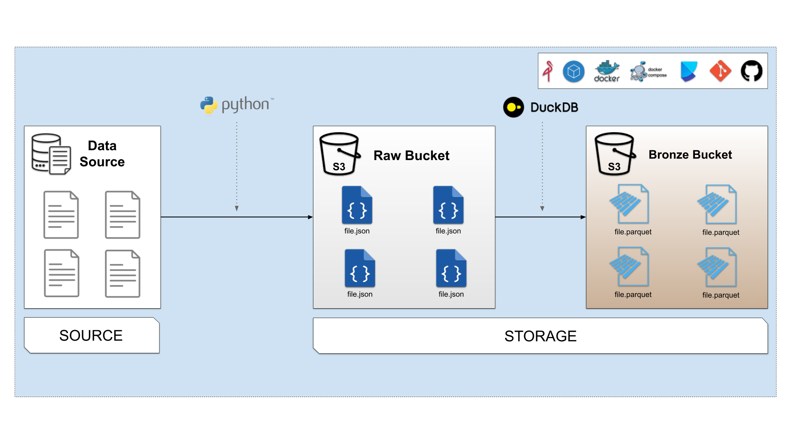

# Dev Container - Apoena Stack

This repository contains the configuration files to create a development container for the Apoena Stack PokéAPI Data Pipeline project.

# PokéAPI Data Pipeline

The PokéAPI Data Pipeline is a project that aims to create a data pipeline to extract, transform, and load data from the [PokéAPI](https://pokeapi.co/) into a datalake.

## About PokéAPI

The PokéAPI is a RESTful API that provides data about the Pokémon games. The API provides data about the Pokémon species, abilities, moves, types, and more.

Pokemon is a media franchise created by Satoshi Tajiri and Ken Sugimori and is managed by The Pokémon Company, a collaboration between Nintendo, Game Freak, and Creatures. The franchise was created by Satoshi Tajiri and Ken Sugimori and is centered on fictional creatures called "Pokémon", which humans, known as Pokémon Trainers, catch and train to battle each other for sport.

The goal of the PokéAPI Data Pipeline project is to create a datalake with the data provided by the [PokéAPI](https://pokeapi.co/).

## Technologies

The PokéAPI Data Pipeline project uses the following technologies:
- [Python](https://www.python.org/)
- [DuckDB](https://www.duckdb.org/)
- [MinIO](https://min.io/)
- [Docker](https://www.docker.com/)
- [Docker Compose](https://docs.docker.com/compose/)
- [Dev Container](https://code.visualstudio.com/docs/remote/containers)
- [Poetry](https://python-poetry.org/)

## Problem Statement

### Data Extraction

The PokéAPI provides a RESTful API to access the Pokémon data. The API provides data about the Pokémon species, abilities, moves, types, and more. The data is provided in JSON format. 

The goal of the data extraction phase is to extract the data from the PokéAPI and store it in a raw format.

### Data Transformation

The data extracted from the PokéAPI is stored in the data lake in a raw format (Raw Bucket) in JSON format.  

The goal of the data transformation phase is to transform the json data into a parquet format and store it in a bronze bucket. The parquet format is a columnar storage format that is optimized for reading and writing data.

### Data Loading

The data transformed in the data transformation phase is stored in the data lake in a bronze format (Bronze Bucket) in parquet format.

The goal of the data loading phase is to load the data from the bronze bucket into a DuckDB database.

### Data Analysis

The data loaded into the DuckDB database can be analyzed using SQL queries. The goal of the data analysis phase is to analyze the data using SQL queries.

### Proposed Solution

The proposed solution is to create a data pipeline that extracts the data from the PokéAPI, transforms the data into a parquet format, loads the data into a DuckDB database, and analyzes the data using SQL queries.

## Data Pipeline Overview

### Architecture

The architecture of the data pipeline is as follows:

The data pipeline consists of the following components:

1. Source: The Source is the PokéAPI that provides the data about the Pokémon species, abilities, moves, types, and more. The data is provided in JSON format.
2. Raw Bucket: The Raw Bucket is a storage bucket that stores the raw data extracted from the PokéAPI in JSON format.   
3. Bronze Bucket: The Bronze Bucket is a storage bucket that stores the transformed data in parquet format.

### Data Pipeline

The data pipeline consists of the following steps:

1. Extract the data from the PokéAPI and store it in a raw format (JSON) in the Raw Bucket.
2. Transform the data into a parquet format and store it in a parquet format in the Bronze Bucket.
3. Load the data into a DuckDB database
4. Analyze the data using SQL queries

The data pipeline is implemented using Python scripts and Docker containers.

## Project Structure
- .devcontainer/ - Contains the configuration files to create the development container
    - devcontainer.json - Contains the configuration of the development container
    - Dockerfile - Contains the instructions to build the development container
    - docker-compose.yml - Contains the configuration of the development container
- .vscode/ - Contains the configuration files for Visual Studio Code
    - launch.json - Contains the configuration of the launch options to debug the project
- images/ - Contains the images used in the README.md file
- src/ - Contains the source code of the project
    - pipeline/ - Contains the pipeline scripts
        - raw_pokemon.py - Contains the script to extract the raw data from the PokéAPI
        - bronze_pokemon.py - Contains the script to transform the raw data into bronze data
    - resources/ - Contains the resources of the project
        - duckdb_manager.py - Contains the script to manage the DuckDB connection
        - s3_manager.py - Contains the script to manage the S3 connection
    - sql/ - Contains the SQL scripts of the project
        - duckdb_playground.sql - Contains the SQL script to play with pokeapi data
- boilerplate.env - Contains the environment variables of the project (copy this file to .env)
- .gitignore - Contains the files and directories that should be ignored by Git
- LICENSE - Contains the license of the project
- poetry.lock - Contains the dependencies of the project
- poetry.toml - Contains the metadata of the project
- pyproject.toml - Contains the configuration of the project
- README.md - Contains the documentation of the project

## Getting Started

### Prerequisites

- [Git](https://git-scm.com/)
- [Docker](https://www.docker.com/)
- [Docker Compose](https://docs.docker.com/compose/)
- [Visual Studio Code](https://code.visualstudio.com/)
- [Visual Studio Code Remote - Containers](https://marketplace.visualstudio.com/items?itemName=ms-vscode-remote.remote-containers)
- [Poetry](https://python-poetry.org/)

## Conclusion

The PokéAPI Data Pipeline project is a project that aims to create a data pipeline to extract, transform, and load data from the PokéAPI into a datalake. The project uses Python, DuckDB, MinIO, Docker, Docker Compose, Dev Container, and Poetry.

## License

This project is licensed under the MIT License - see the [LICENSE](LICENSE) file for details.
